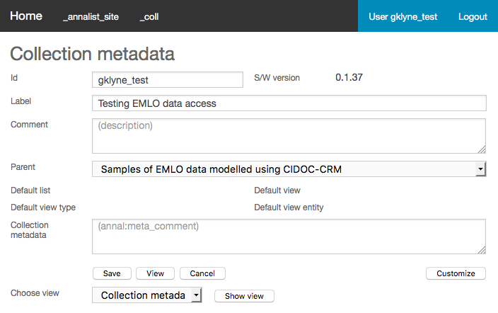
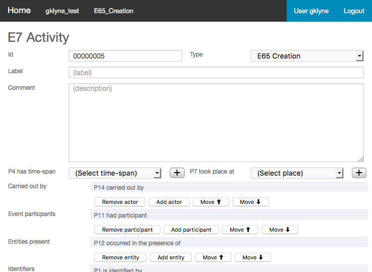

# Using Annalist to create CIDOC CRM linked data for EMLO

Graham Klyne <graham.klyne@oerc.ox.ac.uk>

These notes: [https://github.com/gklyne/EMLO_in_CRM_samples/](https://github.com/gklyne/EMLO_in_CRM_samples/blob/master/EMLO_LD_CRM_Annalist/EMLO_LD_CRM_Annalist.md)

See also: [http://annalist.net/](http://annalist.net/)

## Introduction

Early Modern Letters Online (EMLO) is a database of correspondence that contains information about letters, who sent them, to whom they were sent, and much more.  It is currently built on conventional database technology.  I have been recently been looking at possible RDF linked data representations for these, and have done a little prototyping using the Annalist linked data notebook.  This hands-on session uses this work as a starting point.

This session proceeds in 3 phases:

1. Getting started: login, create a new collection, inheriting existing definitions.  This should provide some initial familiarization with the Annalist linked data notebook.

2. Create new linked data describing a letter, its creation and and transmission.  This should provide insights into CRM's event- or activity-based approach, in which artifacts, actors and more are connected through the events or activities in which they are involved.  (E.g,, a letter connected with it's author and recipient through the activities of authorship and transmission.)

3. Add some details to the structures used to represent information about letters.  This should provide insight into how the CRM model can be realized in RDF.

Taken together, the intent is to show how linked data and CRM can be used to capture the richness of information that is the subject of humanities studies, even if the session can only scratch the surface of that richness.

We shall use a web browser to interact with an Annalist system.  Our intent is to keep the `dhoxss.annalist.net` web server running for at least a year following the DHOxSS 2017 summer school, so you can come back to update and access your data later (but we cannot guarantee of continuity of access or data integrity).  Data on the server may be downloaded as JSON - hopefully, by the end of this session, you will know how to access it.  If you want a copy of the entire collection data as a zip file or Tar archive, email me and I can arrange this (later versions of Annalist software should offer this option through the web interface).

## Phase 1: getting started

Annalist is an open-source system whose goal is to make it easier for individuals and small groups to create, manage and share linked data.  It is a work-in-progress: stable in use but with several desirable capabilities not yet implemented.  Annalist does not attempt to be a complete platform for ontology design, data analysis or data publishing; rather to create data that can be published and processed through other platforms.  

The Annalist philosophy is _data first_: rather than designing an ontology or schema, then creating data to fit that model, Annalist aims to start with data (and maybe an initial data model), and then to build linked data structures to record that data.  The "open world" nature of RDF linked data on the web is particularly well-suited to this approach ("missing isn't broken" - Dan Brickley).

In its current form, Annalist focuses on manually entered data.  BUT, through shared access to common data in a simple textual format, it is possible for data to me mechanically inserted into an Annalist collection.

To get started, we need to log in, and create a new collection within Annalist...

### Login to Annalist

You will need a Google account for this.  If you don't already have one, you can create one by following links from the "Sign in" button on Googler's front page.

1.  Browse to [dhoxss.annalist.net](http://dhoxss.annalist.net/):

    <!--  -->

    

2.  Click on "Login", so show a page like this:

    <!--  -->

    

3.  Enter a username and click on the "Google" button.  You should now be asked to log in to your Google account and give permission for Annalist to access your email address.

    (If the username field is left blank, Annalist will pick a username based on your Google account email address.)

### Create new Annalist collection

(An Annalist collection is an arbitrary aggregation of data records and associated structure definitions that is managed as a composite entity.)

1. Click on the "Home" button.

    

2. Enter a collection name and label into the fields presented.  Preferably, use values that help to identify you as owner of this collection (e.g. prefix with your username.

    

3. Click on "New collection".  The new collection should now appear in the list of collections.

### Set new collection parent

Tell Annalist that the new collection should inherit definitions and data from the "EMLO_in_CRM_samples" collection.

1. Click on the new collection link

    

2. Click on "Customize"

    

3. Click on "Collection metadata"

    

4. Select "Samples of EMLO data [...]" fort the value in the "parent" field.

5. Click on "Save".

6. Clock on "Close" in the "Customize collection" view.

### Set collection default view

The collection now includes access to a lot mof new definitions, but starting from the initial view ("list everything") it is not so easy to navigate.  The parent collection contains a notes page that also includes some useful navigation links:  we shall make this the default view.

1. From the "List entities with type information" view, select the "Scope all" checkbox, and click on "List".  A long list of entities is displayed (these are all the inherited definitions and data records).

2. Look for an entry "EMLO_in_CRM_Notes" (towards the end of the list) and click on it.

    

3. On the resulting display, click "Set default view"

    

    

    

    In the future, clicking on the test collection (e.g. in the top menu bar) should bring up this view rather then the less helpful entity list view.

### Explore data

Now we can start to look at the data:

1. From the default view configured previously, click on "List letters described in collection" to view a list of letters described in the collection.

    

2. Click on the link "work_35372" to view that specific letter.

    

3. To see the original EMLO page for this letter, click on the "EMLO entry for this letter" link.

4. In addition to information about the letter itself, there are links to activities of creation and transmission of the letter, which in turn link to descriptions of the people (Sir Isaac Newton and Dr David Gregory) involved respectively as author and recipient of the letter.

5. Back on the "Letter view", click on the type "Letter" link to see information about how a letter is modeled in terms of FRBRoo terms "F1_Work" and "F2_Expression", which themselves are subclasses of other CIDOC CRM terms.

6. Finally, back on the "Letter view" page, click on the "Data" button to see the underlying stored data.  The data here is JSON-LD, which is a syntax for representing RDF based on JSON.  This form of data is relatively easy to read and process using (say) Python or Ruby, but can also be ingested in to an RDF data store to be processed as linked data (e.g. queried using SPARQL).

## Phase 2: create new data

In this phase, we look at how CIDOC CRM might be used to record information about Early Modern Letters, using information from the EMLO project.

International Council of Museums (ICOM) Documentation Group (CIDOC) has over many years designed and defined their Conceptual Reference Model (CIDOC CRM) for describing museum artifacts.  At it's heart is an "event-based" model that can be applied to a range of cultural and other kinds of information.  (The model has similarities with more recent work to describe provenance of online data, notably W3C PROV).

In this exercise, we will use CIDOC CRM definitions pre-loaded in Annalist to create a description of an Early Modern Letter from EMLO.  We will describe a letter (artifact) that is linked to involved people (author, recipient) by activities (creation, transmission)

### Pick a letter from EMLO: open in new tab

1. In a new browser tab or window, use the search form at http://emlo.bodleian.ox.ac.uk/ - all fields may be left blank, or enter some search options.

2. Click on "Search"

3. Click on "Letter" link for an entry

    e.g. http://emlo.bodleian.ox.ac.uk/profile/work/a26c6d0e-fa5b-4ea4-b93a-3894ab3d5962

### Create a new letter in the Annalist collection

1. Choose an identifier for the new record.  I have been using a combination of the EMLO record type ("work") and Record Id, which can be found in a panel at the bottom of the page.  For the example record above, this would be "work_949200".  The identifier can be any sequence of up to 128 letters, digits and/or "_" starting with a letter.

2. View the list of letters in the new collection (e.g. use the "List letters described in collection" link on the EMLO CRM modeling notes page viewed previously)

    

3. Click on the "New" button to bring up a form to enter details of a new letter:

    

    In the "Id" field (which will contain "00000001" or similar), enter your chosen Id for the new letter record (e.g. "work_949200").

4. Fill in some details from the EMLO letter page; e.g.

    

    Note that the "Comment" field in the form may contain Markdown formatting commands, which are used to present the comment as formatted text when viewing the record.

    Click "Save" to save the values entered.  (It is not necessary to enter values in every field: additional values may be added later as they become available.)

    The new letter is shown in a list of of letter records defined in the current collection:

    

    Click on the "Id" column value for the new letter to see what has been entered so far:

    

### Create creation activity record

1. Our next step is to add more information about the creation (authoring) of the new letter.  Click on the "Edit" button in the letter view.

    Next, click on the "+" button in the row labelled "Created":

    

    I suggest this new activity be given an ID "creation_***", where "letter_***" is the Id of the letter whose creation is described.  In my example, this would be "created_949200".  Enter your chosen Id into the form.

    Fill in the label and comment fields with relevant details from the letter record, e.g.

    

2. Now create a record describing the author of the letter, to be referenced by the creation activity record.  Click on the button "Add actor" in the row labeled "Carried out by".  A new field is displayed containing "(Select actor)", beside which is a button containing a "+" symbol.  Click on the "+" button:

    

3. In the EMLO database tab/window, click on the link "Oldenburg, Henry, 1619-1677" in the "People" section to bring up a view about the letter's author.

4. In the Annalist tab/window, enter an Id and other details from the EMLO data, e.g.:

    

    Click on "Save".  The previous Activity editing form is redisplayed.  In the drop-down field in the row labeled "Carried out by", select the new actor record just created (e.g., "Oldenburg, Henry, 1619-1677".

5. Click the "Save" button in the Activity description record to be returned to the letter view.

    In the drop-down field "(activity that created this letter)" select the new creation activity record just created (e.g., "2 Jan 1672: Oldenburg, Henry, to Newton, Isaac (Sir)").

Creating multiple linked records as we do here involves navigating between the various entity records (letter, activity, actor, _etc_.).  Annalist tries to maintain a history of where you have been and take you back to the right place, but it is possible to get lost in a maze of linkages.  If this happens, return to the top-level view of the collection, and use the links on the notes page to navigate back to a view of the letter, activity or person that you wish to work with.

### Create transmission activity record

A similar pattern can be followed to create a transmission activity record:

1. Click on "+" button in row labelled "Transmitted"

2. Enter an Id (e.g. "transmission_949200") label and description for the transmission activity.

3. The person who received the letter should be mentioned as an "Event participant".  If needed, create a new Actor record describing the recipient.

4. Clicking "Save" on the transmission activity view should return to the letter view.

5. In the Letter view, in the drop-down field in the row labelled "Transmitted", select the new transmission activity record that has just been created (e.g., "2 Jan 1672: Oldenburg, Henry, to Newton, Isaac (Sir)").

    The resulting saved letter view should appear something like this:

    

6. The stored JSON-LD for the various records can be viewed and downloaded by clicking on the "Data button.  Collected JSON for the collecton can be obtained by using the "Data" button from a

## Phase 3: extending Annalist definitions

So far,we have been working with definitions that already exist in the Annalist system we are using.  Finally, we look at how the structure of Annalist linked data can be modified by new or updated definitions.

We create definitions for describing additional aspects of a letter that are not covered by the existing definitions.

### Add field for language of letter

1. View any letter in the collection, then click on the "View description button"

2. Click on the "Edit" button

3. Click on the "Add field" button.  The form is redisplayed with an additional field entry at the end of the field list, showing the value "(field sel)".  Click on the "+" beside this new entry, and a new "Field definition" form is displayed.

4. For this exercise, I want to add the language description as a simple "Short text" field.  Many of the fields shown on the form can be ignored for this purpose.  Fill in or select values for `Field id`, `Render type`, `Field label`, `Help`, `Property URI`, `Position/size`, `Value type`, `Entity type`, `Placeholder`, and `Tooltip`.  Other fields may be left unchanged, so leave a resulting form something like this:

    

5. Click "Save" and the view definition should re-appear.  For the field that appears as "(field sel)", select the newly defined value (e.g., "Language of letter") from the drop-down for this field.

6. The fields are listed in the order that they appear in letter views. In this case, I'd like the language field to appear beside the field "Date as marked".  To move the the new field into this new position, select the checkboxes by every field below the "Date as marked" down to but not including the new "Language of letter field":

    

    Then click on the "Move ⬇" button.
    
    (This sequence is slightly counter-intuitive, but it is quicker then selecting the single field and moving it up 11 times!)

7. Select the value "6/6" for the position/size of the moved field, and then click on the "Save" button.

8. Click the "Close" button.  The letter should be redisplayed with a new field (e.g., "Language of letter") beside the "Date as marked" field.

9. Clicking on the "Edit" button will bring up the edit view for the letter, into which a value (e.g., "English?") may be entered for the language.  Click "Save" to store this new value.

To recap, we have just added a new field (and property) to an existing entity type and view, and added a value for this field in the record created earlier.

### Add collection details

In this final exercise, we create a new entity type and view, and add a reference to this type in the letter type.

The EMLO data contains information about and references to collections in which letters are held or documented.  This is not currently reflected in the linked data model we are using.

1. Create new collection type

    * The CRM collection type, crm:E78_Collection, is a subtype of crm:E24_Physical_Man-Made_Thing.  To create a subtype definition, we'll start from a view of the parent type.
    * Go to the collection default view (set up earlier) by clicking on the collection name in the menu bar, and select the link "Entity types used to model EMLO data".  An empty list is displayed.  Select the "Scope all" checkbox, then click on "List" - this brings up a list of entity types including those inherited from other collections.
    * From the list, click on the link labeled "E24_Physical_Man_Made_Thing".  A "Type definition" view is displayed.  Click on the "Define subtype" button.
    * A new type definition form is displayed: fill in values for `Type Id`, `Label`, `Comment` and `Type URI`, leaving other fields unchanged:

    

    (The screenshot example here shows text copied from the CIDOC CRM documentation: for the purposes of this exercise, it is not necessary to copy all this text, and the comment field could be left blank for now.)
    
2. Create View and List for E78_Collection

    Click on the "Define view+list" button.  This will save the values entered, create new view and list definitions for E78_Collection entities, and update the default view and list values in the type definition.

3. Edit view definition to include fields: 

    * Click on the "✍" (writing hand) icon in the "Default view" field.  This brings up an editing form for updating the newly created view definition (which is initialized with a copy of the view definition for the supertype.
    * Remove the fields below the "Comment" field (select checkboxes then click "Remove selected field(s)"
    * Following a procedure similar to that used above, new fields corresponding to what is stored in EMLO can be added here, e.g.:
        * contextual summary (use existing "Comment" field)
        * primary contributors (ref actors) 
        * partners and additional contributors (long text)
        * contents (long text)
        * provenance (long text)
        * scope (long text)
        * Further resources (list of long text values)

4. Create collection record (copy/paste from EMLO)

    * Bring up a list of collections, select "New"
    * Fill in title and details (suggest copy-and-paste from EMLO entry)
    * Fill in primary contributor detail: will need to create new actor record

5. Add source of record fields (text and ref collection) to letter view

6. Add source of record information to the letter description record.
